# 🎬 My Movies – Application de Consultation Cinématographique


**My Movies** est une application web dynamique permettant la consultation et la gestion d’une base de données de **films** et de **séries**.

Ce projet a été développé dans le cadre de la **Licence 2 Informatique (2023-2024)** et illustre la maîtrise du développement web full-stack (frontend + backend + base de données).

---

## 🎯 Objectif du Projet

L’objectif principal est de concevoir une application web complète, interactive et sécurisée intégrant :

1. **Une interface utilisateur moderne** pour consulter les films et séries.
2. **Un système CRUD complet** (Create, Read, Update, Delete) pour gérer le contenu.
3. **Une gestion des rôles utilisateurs** (Admin / User).
4. **Un backend en PHP / SQL** connecté à une base de données MySQL / MariaDB.
5. Une architecture séparant clairement **front**, **backend** et **assets** .

---

## ✨ Fonctionnalités Clés

### 🔹 1. Consultation (Utilisateur / Public)
- Catalogue dynamique des films et séries.
- Fiches détaillées : synopsis, affiche, bande-annonce, note, type (film / série).
- Recherche par titres, acteurs, réalisateurs ou catégories.
- Navigation entre films, acteurs, réalisateurs et tags.

### 🔹 2. Administration (Rôle Admin)
- Dashboard sécurisé après connexion.
- Gestion complète du contenu (films, acteurs, réalisateurs, catégories…).
- Gestion des utilisateurs et rôles.

---

## 🛠️ Stack Technique

| Catégorie | Technologie |
|----------|-------------|
| Backend | PHP |
| Base de données | MySQL / MariaDB |
| Frontend | HTML, CSS, JavaScript |
| Serveur | Apache2 |
| Éditeur | VS Code |
| OS | Linux |

---

## ▶️ Installation & Exécution

### 1️⃣ Installer LAMP
```bash
sudo apt install apache2 mariadb-server php php-mysql
```

### 2️⃣ Démarrer les services
```bash
sudo systemctl start apache2
sudo systemctl start mariadb
```

### 3️⃣ Accéder à l'application
```
http://localhost/My-Movies-main-old/
```

---


## 📸 Aperçus

| Écran | Description |
| :--- | :--- |
| 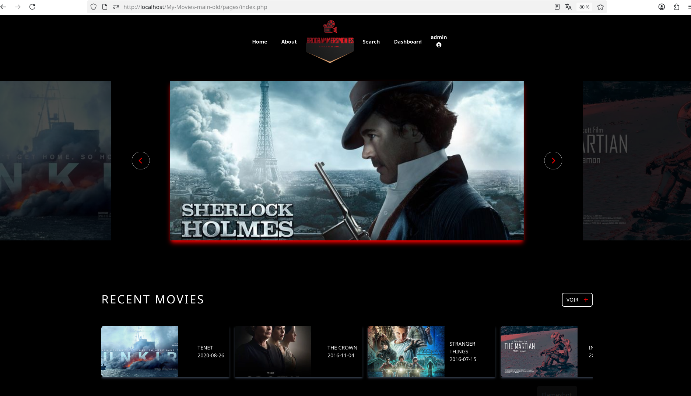 | Accueil (Carrousel et Films Récents) : Présentation des contenus phares et nouveautés. |
| 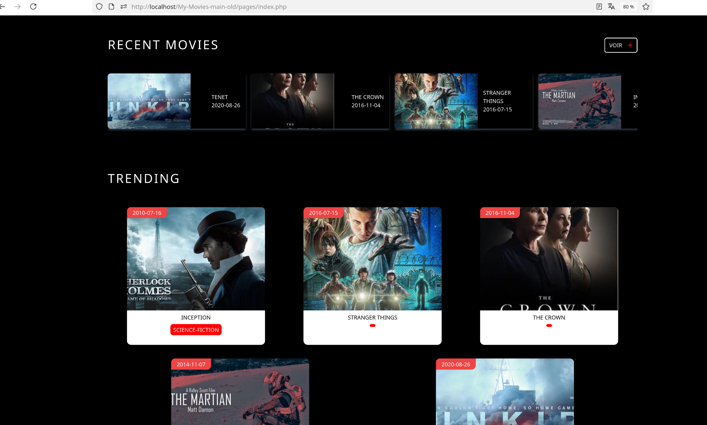 | Catalogue Étendu : Vue détaillée des films récents et tendances. |
| 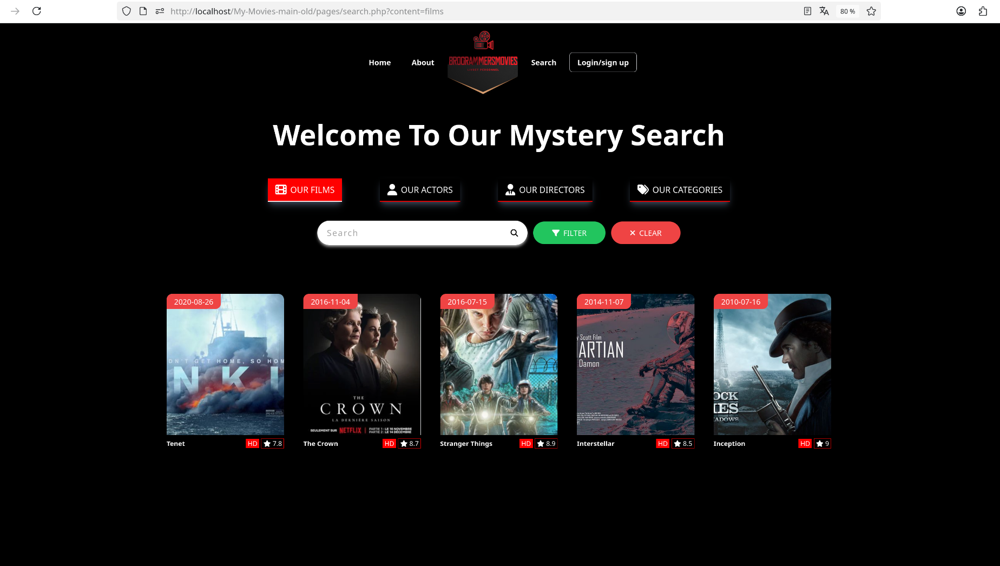 | Recherche et Filtrage : Interface pour trouver films, acteurs, réalisateurs ou catégories. |
| 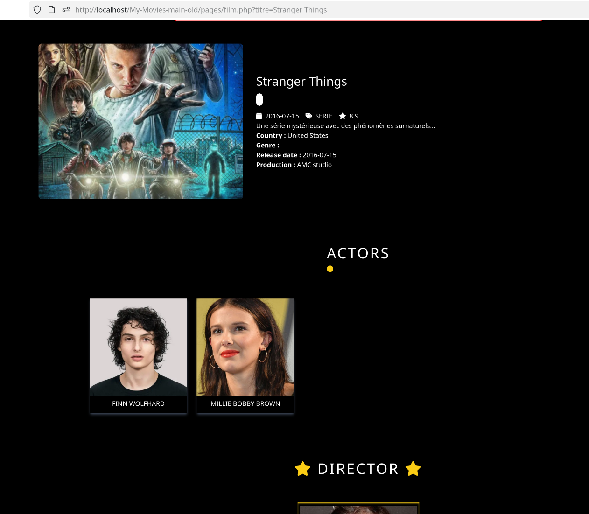 | Détail d’un film : Présentation complète du film. |
| 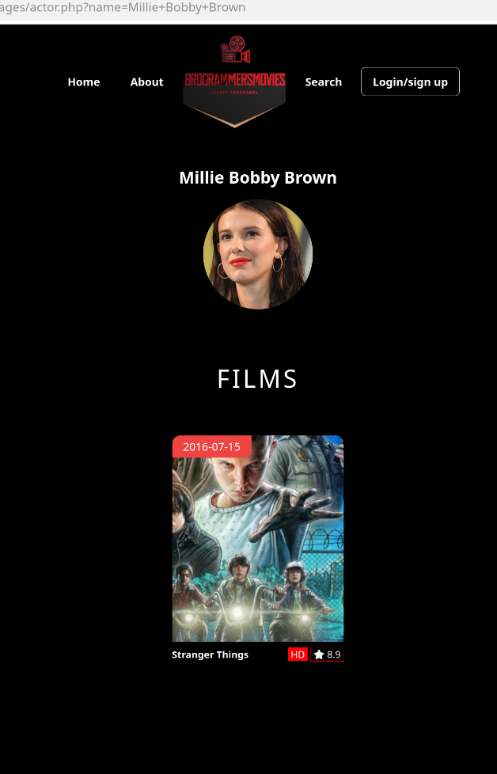 | Détail d’un acteur ou d’un réalisateur : Présentation de la personne. |
| 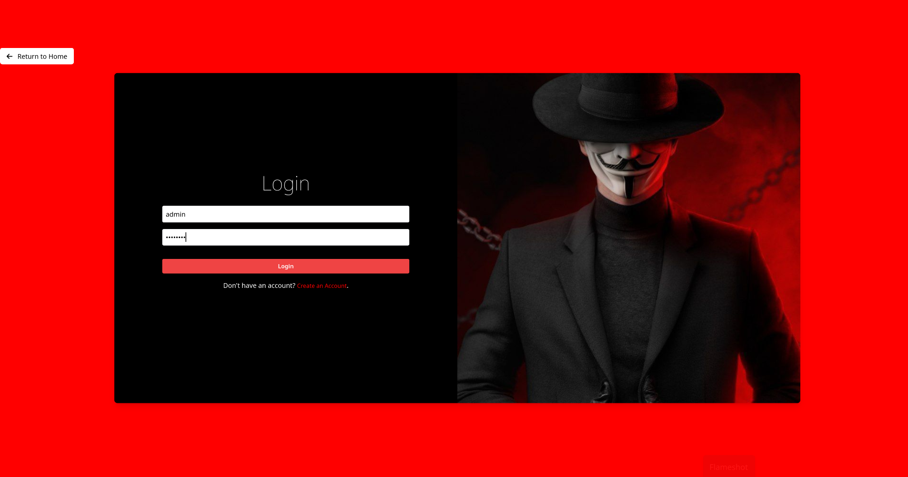 | Authentification : Page de connexion pour les utilisateurs et administrateurs. |
| 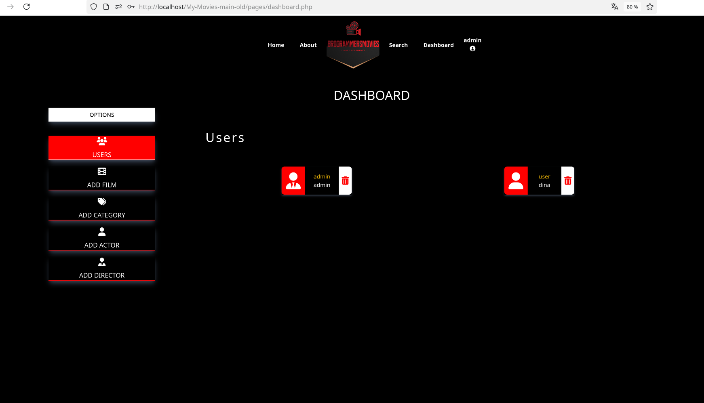 | Dashboard Admin : Tableau de bord pour les administrateurs. |
|  | Dashboard Admin : Formulaire d’ajout d’acteur. |
| 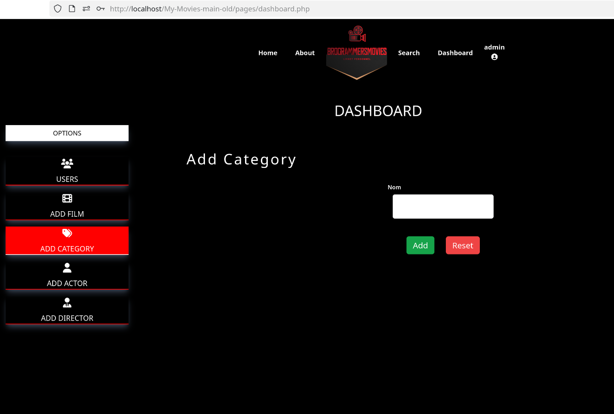 | Dashboard Admin : Formulaire d’ajout de catégorie. |
| 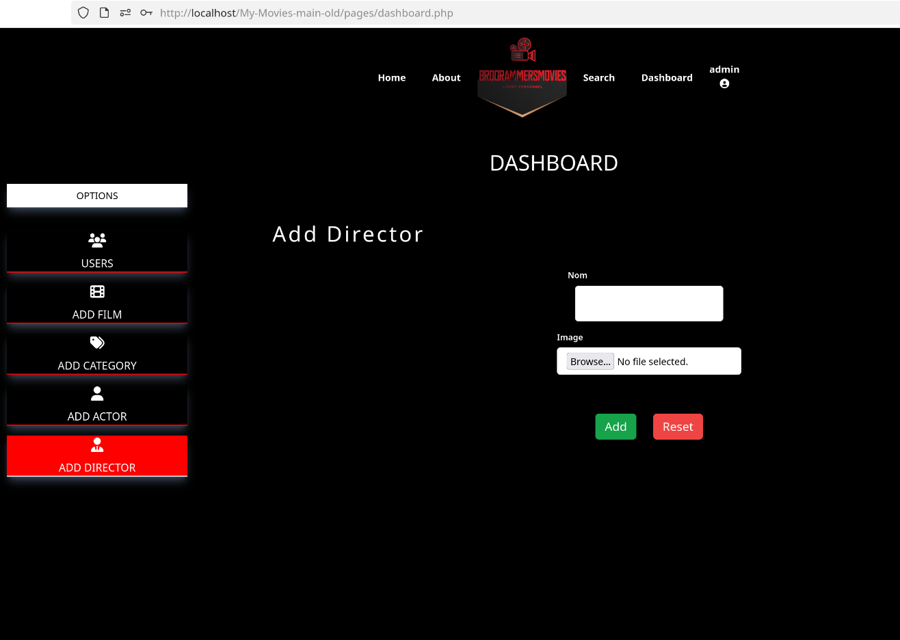 | Dashboard Admin : Formulaire d’ajout de réalisateur. |
| 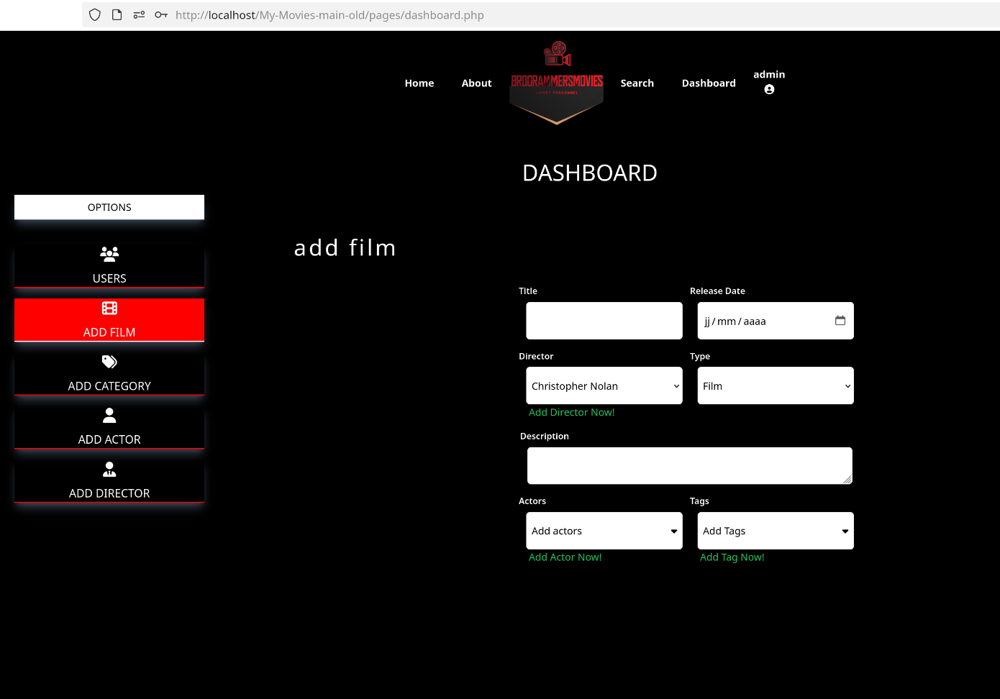 | Dashboard Admin : Formulaire d’ajout de film. |
| 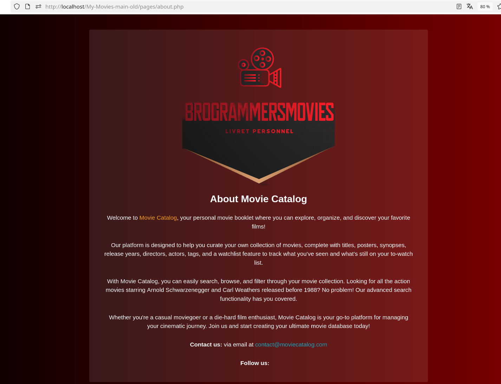 | Page À propos : Définition du service, mission du catalogue et informations de contact. |


---


## 🏁 Conclusion

Projet universitaire complet combinant **PHP**, **SQL**, **HTML/CSS/JS**, sécurité et gestion de rôles. 